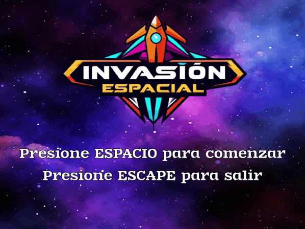

# Invasión Espacial 🚀👾
**Invasión Espacial** es un videojuego arcade en 2D desarrollado con `Pygame`, inspirado en los clásicos juegos de disparos espaciales.



## 🕹️ Controles
- **Izquierda/Derecha**: Mueve la nave.
- **Espacio**: Dispara.
- **ESC**: Salir del juego.

## ⚙️ Requisitos
1. Clonar el repositorio.
2. Instala las dependencias ejecutando:
```bash
pip install -r requirements.txt
```
3. Ejecutar el juego con:
```bash
python invasion.py
```